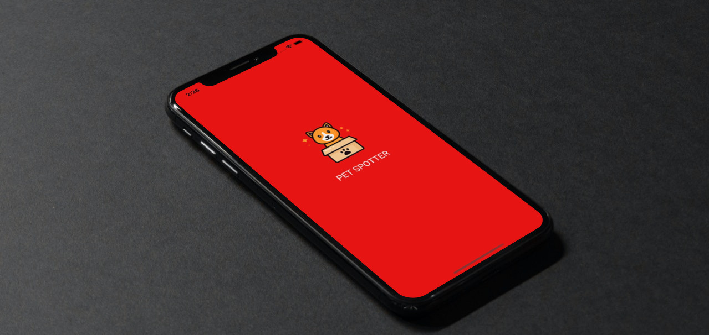
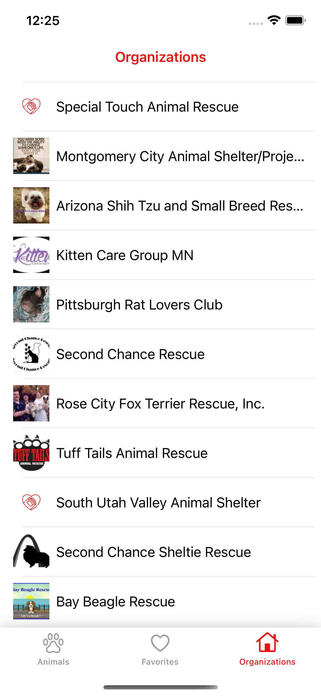
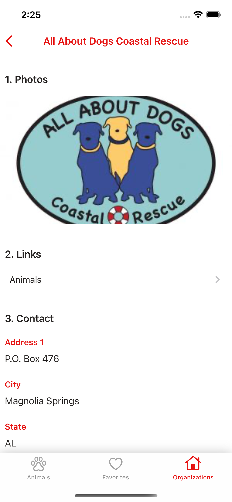
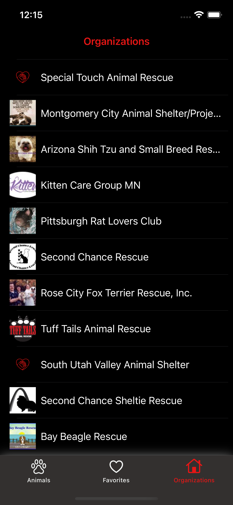
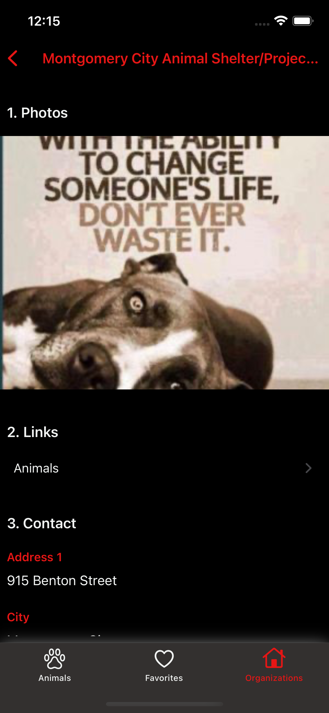

 [](https://developer.apple.com/swift/) [](https://opensource.org/licenses/MIT)

# Pet Spotter


## Table of Contents
- <a href="#about">About</a>
- <a href="#Introduction">Introduction</a>
- <a href="#app-features">Application Features</a>
- <a href="#requirements">Requirements</a>
- <a href="#tech">Tech</a>
- <a href="#considerations">Considerations</a>
- <a href="#license">License</a>

## Introduction
Some animals require adoption to avoid dumping or overloading at the shelter. Pet Spotter helps pets to meet with their adopters.

## Features
### Animals Scene
- Browse pets such as dogs, cats, puppies, kittens, rabbits & more.

### Filter Scene
- Filter pet results by name, age, size, gender, care & behavior, coat length, or status.

### Animal Detail Scene
- Review pet bios to learn more about the pet’s details.
- Save your favorite pets for tracking them.
- Browse the organization from detail scene for the selected pet.

### Favorites Scene
- Browse your favorite pets that you saved before. Review their bios.

### Orgaizations Scene
- Browse organizations, select one of them, review their bios.

### Organization Detail Scene
- Review organization bios to learn more about the organization’s detail such as work days, contact info and more.
- Browse pets that are registred in the organization. 

## Screens
### Light Mode
| Animals | Filter | Animal Detail | Favorites | Orgaizations |  Organization Detail
| --- | --- | --- | --- | --- | --- |
|  |  |  |  |  |  |

### Dark Mode
| Animals | Filter | Animal Detail | Favorites | Orgaizations |  Organization Detail
| --- | --- | --- | --- | --- | --- |
|  |  |  |  |  |  |


## Requirements

- Xcode: Version 14.0 Beta
- Language: Swift 5.7
- Minimum iOS Version: 13
- Device Orientation: Portrait Mode
- Dependency: No 3rd party dependency

## Tech

### Architecture
This project is designed by MVVM-C architecture pattern where:


Using MVVM-C pattern gives us some benefits like code reuse, ease of testing, bindings make UI updates easier to handle, ease of maintainability.

And splitting off protocols (DataSource and Delegate) into separate objects we can re-use those objects in other view controllers, or use different objects in the same view controller to get different behavior at runtime.

- View is represented by `UIViewController` designed in Storyboard
- Model represents state and domain objects
- ViewModel interacts with Model and prepares data to be displayed. View uses ViewModel's data either directly or through bindings (using Closures) to configure itself. View also notifies ViewModel about user actions like button tap. ViewModels transform inputs from view and return an output object that holds data/actions.
- Service layer is where the logic of dealing with responses from the network request is handled. ViewModels should interface this layer to get updated data as necessary.
- Coordinator is responsible for handling application flow, decides when and where to go based on events from ViewModel (trigers routing functions).

`View` <- `ViewController` <- bindings -> (`ViewModel` -> `Model`) <- trigers -> `Coordinator`

### Networking
The Petfinder REST API at https://www.petfinder.com/developers/ is used. Obtain a client ID and client secret to use the REST API. 

There are two layer for creating network requests. API enums are used for creating request and the provider is for sending requests that are creaded by APIs. 

- `/oauth2/token`
```
GET https://api.petfinder.com/v2/oauth2/token
```
> This API call returns a token that is used for authentication to make a request for other APIs. Token is saved into `UserDefaults`, it is called for network requests that need authentication.

- `/animals`
```
GET https://api.petfinder.com/v2/animals
```
> This API call returns a list of animals in the Petfinder database that fit the criteria given in the query parameters, and is used to return a list of adoptable pets based on the search queries provided by the user.

- `/animals/{id}`
```
GET https://api.petfinder.com/v2/animals/{id}
```
>This API call returns details for a specific animal with the given ID in the path, and is used in the application to display information on a single pet that the user selects from the list of adoptable pets.

- `/organizations`
```
GET https://api.petfinder.com/v2/organizations
```
> This API call returns a list of organizations in the Petfinder database that fit the criteria given in the query parameters.


### Persistent Data
Core Data used for local persistence. Save favorite animals using Core Data. A service layer (FavoriteService) uses the context from DataController that is a provider for CRUD operations on persistent data.


## Considerations

Following are few considerations while writing code

- Code is following `MVVM-C` Architecture. 
- Every layer is interfaced via `dependency management` and lays foundation for high level DI structure.
- Code is following `iOS Swift Style Guidelines` and have same styling throughtout the code. 
- Project is structured to `scale` as big as it can be 
- `Folder structure` is highligting the architecture   
- Layers are interfaced together via `Protocols`
- Dependency resolution is being done via Factory. 
- Control environments via `XCConfig` files for each scheme like `Debug` or `Release`.
- `UserDefaults` stores credentials with an object.

## License
```
Copyright (c) 2021 Haydar Karkin

Permission is hereby granted, free of charge, to any person obtaining a copy
of this software and associated documentation files (the "Software"), to deal
in the Software without restriction, including without limitation the rights
to use, copy, modify, merge, publish, distribute, sublicense, and/or sell
copies of the Software, and to permit persons to whom the Software is
furnished to do so, subject to the following conditions:

The above copyright notice and this permission notice shall be included in all
copies or substantial portions of the Software.

THE SOFTWARE IS PROVIDED "AS IS", WITHOUT WARRANTY OF ANY KIND, EXPRESS OR
IMPLIED, INCLUDING BUT NOT LIMITED TO THE WARRANTIES OF MERCHANTABILITY,
FITNESS FOR A PARTICULAR PURPOSE AND NONINFRINGEMENT. IN NO EVENT SHALL THE
AUTHORS OR COPYRIGHT HOLDERS BE LIABLE FOR ANY CLAIM, DAMAGES OR OTHER
LIABILITY, WHETHER IN AN ACTION OF CONTRACT, TORT OR OTHERWISE, ARISING FROM,
OUT OF OR IN CONNECTION WITH THE SOFTWARE OR THE USE OR OTHER DEALINGS IN THE
SOFTWARE.
```